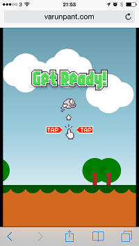
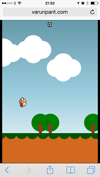
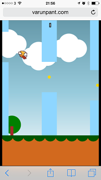
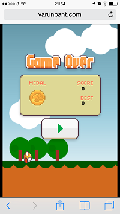

# CrappyBird

Este repositório e um fork do projeto CrappyBird (clone de Flappy Bird em JavaScript/Canvas 2D), usado como base para atividades praticas de manutenção evolutiva, adaptativa, preventiva e corretiva.

## Contexto da disciplina

- Disciplina: **Manutenção de Software (MS28S)**
- Instituição: UTFPR
- Docente: **Prof. Dr. Gustavo Santos**

## Objetivo deste fork

Este fork existe para apoiar o processo da disciplina, cujo foco e melhorar e otimizar um software existente, bem como reparar defeitos. Ao longo do semestre, as mudanças planejadas e implementadas neste projeto devem refletir os conceitos estudados em aula.

As solicitações de mudança levantadas para o projeto estão documentadas em:

- `docs/solicitacoes_mudanca.md`

Observacao da disciplina: as solicitações podem evoluir ao longo das semanas conforme analise, prioridade e esforço estimado.

## Como executar localmente

- Windows: `start.bat`
- macOS/Linux: `sh start.sh`
- Host/porta personalizados:
  - macOS/Linux: `HOST=0.0.0.0 PORT=3000 sh start.sh`
  - Windows (PowerShell): `$env:HOST='0.0.0.0'; $env:PORT='3000'; .\start.bat`

O servidor local e um servidor estático leve em Node.js (`scripts/serve.js`), sem dependência de Python.

## Estrutura do projeto

- `index.html`: ponto de entrada da aplicacao
- `src/js/game/`: logica do jogo modularizada (`core`, `states`, `entities`, `audio`, etc.)
- `src/js/game.js`: placeholder legado
- `src/css/styles.css`: estilos
- `assets/images/`: imagens
- `assets/audio/`: sons
- `docs/screenshots/`: capturas de tela
- `scripts/serve.js`: servidor estático local

## Screenshots

## Projeto original

- Repositório base: [varunpant/CrappyBird](http://varunpant.com/resources/CrappyBird/index.html)

## Licença

Este projeto esta licenciado sob a MIT License. Veja `LICENSE`.
